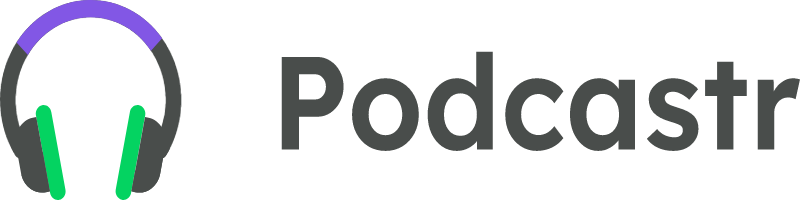
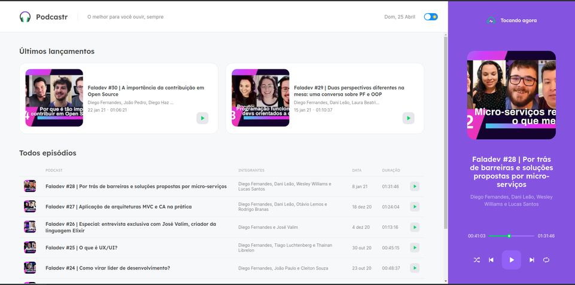
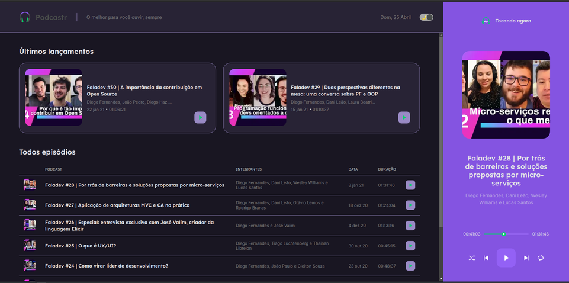
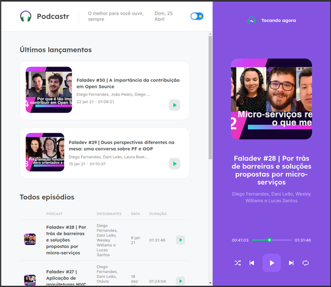
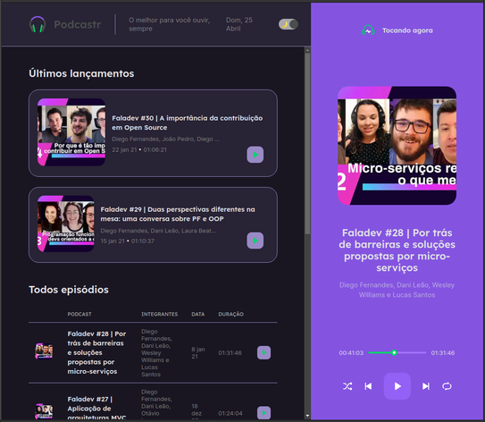

<h1 align="center">
  
</h1>
<h4 align="center">🚀 Project Podcastr created during the NLW #05 of Rocketseat. 🚀</h4>


<p align="center">
  

  
  
  <a href="https://github.com/remulocosta/next-podcastr/commits/master">
    
  </a>

  <a href="https://github.com/remulocosta/next-podcastr/issues">
    
  </a>

  
</p>

<p align="center">
  
</p>
<p align="center">
  
</p>

### 📎 Features

- [x] List of episodes of the "FalaDEV" Podcast
- [x] Static Page Generation
- [x] Episode details
- [x] Audio Player Creation
- [x] Creation of all the player's functionalities
- [x] Themes
- [ ] Audio device selection
- [ ] Volume control

## :computer: Technologies

This project was made using the following technologies:
* [Next.js](https://nextjs.org/)
* [React.js](https://reactjs.org/)
* [Typescript](https://www.typescriptlang.org)

## ⛏ Dependencies

* [Sass](https://sass-lang.com)
* [JSON Server](https://github.com/typicode/json-server)
* [date-fns](https://date-fns.org)
* [axios](https://github.com/axios/axios)
* [rc-slider](https://github.com/react-component/slider)
* [next-themes](https://github.com/pacocoursey/next-themes)
* [Prettier](https://prettier.io/docs/en/editors.html)

## :construction_worker: How to run

```
# Clone Repository
$ git clone https://github.com/remulocosta/next-podcastr

# Go to folder
$ cd podcastr

# Install Dependencies
$ yarn

# Run Web Server
$ yarn dev

# Run Server
$ yarn server
```
## ❔ Questions
If there are any questions regarding this repository, send it to remulo.costa@gmail.com

Made with ❤︎ by Remulo Costa

Give a ⭐️ if this project helped you!
